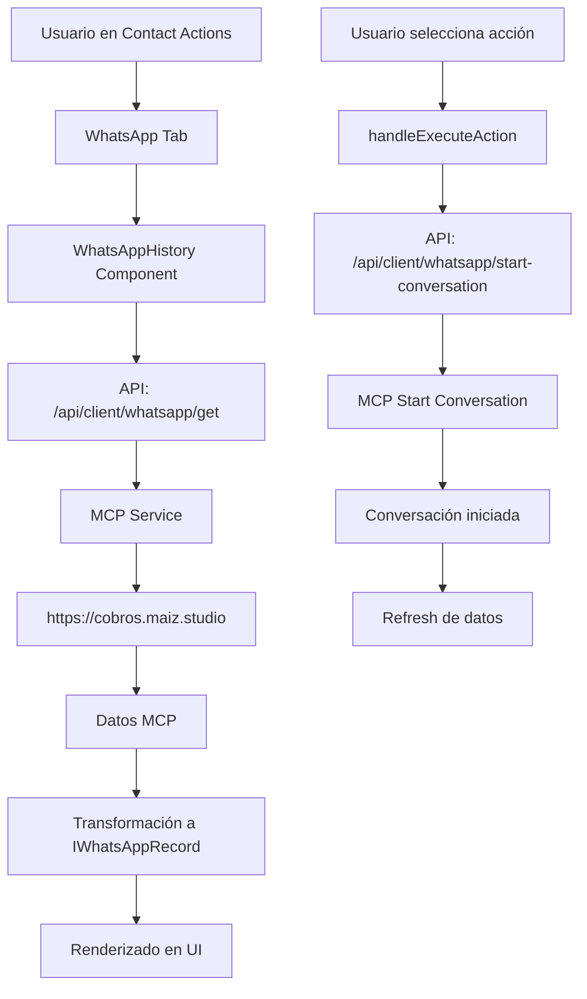

# MCP WhatsApp Integration - Documentación Técnica

## 📋 Resumen de Implementación

Se ha implementado exitosamente la integración completa con el servicio MCP (Model Context Protocol) para WhatsApp, permitiendo la gestión de conversaciones en tiempo real desde la interfaz de acciones de contacto.

## 🏗️ Arquitectura Implementada

### Componentes Creados

#### 1. **Servicio MCP WhatsApp** (`/lib/services/mcpWhatsApp.ts`)
- ✅ **Función formateadora**: `formatClientForMCP()` - Transforma datos IClient a formato MCP
- ✅ **Gestión de conversaciones**: `startWhatsAppConversation()` - Inicia conversaciones
- ✅ **Obtención de mensajes**: `getWhatsAppConversations()` - Recupera historial
- ✅ **Transformación de datos**: `transformMCPToWhatsAppRecord()` - Convierte datos MCP a formato interno

#### 2. **Endpoint API actualizado** (`/app/api/client/whatsapp/get/route.ts`)
- ✅ **Integración MCP**: Consume servicio MCP como fuente principal
- ✅ **Sistema Fallback**: Usa Firebase como respaldo si MCP falla
- ✅ **Filtrado por días**: Soporta filtros temporales (1, 2, 3, 10, 15 días)
- ✅ **Manejo de errores**: Logging completo y manejo robusto de errores

#### 3. **Nuevo endpoint start-conversation** (`/app/api/client/whatsapp/start-conversation/route.ts`)
- ✅ **Inicio de conversaciones**: Permite iniciar conversaciones desde la interfaz
- ✅ **Validación de datos**: Verifica existencia del cliente en Firebase
- ✅ **Integración completa**: Usa el servicio MCP para operaciones reales

#### 4. **Componente WhatsAppHistory actualizado** (`/components/clients/WhatsAppHistory.tsx`)
- ✅ **Consumo de API real**: Conectado al endpoint MCP
- ✅ **Filtrado dinámico**: Responde a cambios de filtro temporal
- ✅ **Ejecución de acciones**: Botón "Ejecutar Acción" funcional
- ✅ **Interfaz mejorada**: Feedback visual y manejo de estados de carga

## 🔄 Flujo de Datos



## 📊 Transformación de Datos

### IClient → MCP Format
```typescript
// Entrada (IClient)
{
  id: "client123",
  name: "Juan Pérez",
  national_id: "12345678",
  phone: "+57300123456",
  debt: 150000,
  loan_letter: "LOAN001",
  email: "juan@email.com"
}

// Salida (MCP Format)
{
  clientId: "client123",
  name: "Juan Pérez", 
  national_id: "12345678",
  phone: "+57300123456",
  debt: 150000,
  loan_letter: "LOAN001",
  email: "juan@email.com"
}
```

### MCP Response → IWhatsAppRecord
```typescript
// Entrada (MCP)
{
  id: "msg123",
  timestamp: "2024-01-15T10:30:00Z",
  direction: "inbound",
  message: "Hola, necesito información sobre mi préstamo",
  message_type: "text"
}

// Salida (IWhatsAppRecord)
{
  id: "msg123",
  clientId: "client123",
  timestamp: { _seconds: 1705312200, _nanoseconds: 0 },
  messageDirection: "inbound",
  messageContent: "Hola, necesito información sobre mi préstamo",
  interactionType: "text",
  isBotConversation: true,
  botSessionId: "msg123"
}
```

## 🛠️ APIs Implementadas

### 1. GET WhatsApp History
**Endpoint**: `POST /api/client/whatsapp/get`

**Request Body**:
```json
{
  "clientId": "client123",
  "tenantId": "default-tenant",
  "organizationId": "default-org",
  "days": 7
}
```

**Response**:
```json
{
  "success": true,
  "data": [/* IWhatsAppRecord[] */],
  "count": 15,
  "totalMessages": 15,
  "periodDays": 7,
  "source": "MCP WhatsApp Service"
}
```

### 2. Start WhatsApp Conversation
**Endpoint**: `POST /api/client/whatsapp/start-conversation`

**Request Body**:
```json
{
  "clientId": "client123",
  "tenantId": "default-tenant", 
  "organizationId": "default-org"
}
```

**Response**:
```json
{
  "success": true,
  "data": {
    "success": true,
    "conversation_id": "conv_456",
    "client_id": "client123",
    "message": "Conversation started"
  },
  "conversationId": "conv_456",
  "source": "MCP WhatsApp Service"
}
```

## 🔧 URLs MCP Configuradas

- **Start Conversation**: `POST https://cobros.maiz.studio/start-conversation/{clientId}`
- **Get Conversations**: `GET https://cobros.maiz.studio/users/{clientId}/conversations?days=7`

## 🎯 Funcionalidades Implementadas

### ✅ Completadas
1. **Servicio MCP completo** - Todas las funciones de integración
2. **API endpoints actualizados** - GET y START conversation
3. **Componente UI funcional** - WhatsAppHistory conectado a MCP
4. **Sistema de fallback** - Firebase como respaldo si MCP falla
5. **Filtrado temporal** - Soporte para 1, 2, 3, 10, 15 días
6. **Ejecución de acciones** - Botón funcional para iniciar conversaciones
7. **Transformación de datos** - Bidireccional IClient ↔ MCP
8. **Manejo de errores** - Logging y feedback visual

### 🚀 Integración en Contact Actions
- **Tab WhatsApp**: Funcional con datos reales de MCP
- **Filtros temporales**: Botones 1d, 2d, 3d, 10d, 15d operativos
- **Dropdown de acciones**: Conectado a MCP start-conversation
- **Chat UI**: Muestra conversaciones reales en formato chat

## 📝 Notas Técnicas

### Consideraciones de Implementación
1. **Tenant/Organization IDs**: Actualmente usando valores hardcodeados ('default-tenant', 'default-org'). En producción deberían venir del contexto de usuario.

2. **Refresh después de acción**: Implementado con `window.location.reload()` - podría optimizarse con revalidación de datos.

3. **Error Handling**: Sistema robusto implementado con fallback a Firebase si MCP no está disponible.

### Estructura de Archivos
```
├── lib/services/mcpWhatsApp.ts                    # Servicio MCP
├── app/api/client/whatsapp/
│   ├── get/route.ts                              # GET conversations  
│   └── start-conversation/route.ts               # START conversation
├── components/clients/WhatsAppHistory.tsx         # UI Component
├── modules/clients/types/clients.ts              # Type definitions
└── MCP_WHATSAPP_INTEGRATION.md                  # Esta documentación
```

## 🔄 Testing
Para probar la integración:

1. **Ir a Contact Actions** de cualquier cliente
2. **Seleccionar tab WhatsApp Chat**
3. **Probar filtros temporales** (botones 1d, 2d, etc.)
4. **Seleccionar acción** en dropdown
5. **Hacer clic en "Ejecutar Acción"**

El sistema debería:
- Cargar datos desde MCP service
- Mostrar conversaciones en formato chat
- Permitir iniciar nuevas conversaciones
- Usar Firebase como fallback si MCP falla

---

**Estado**: ✅ **COMPLETADO**  
**Fecha**: 2024-01-28  
**Desarrollador**: Claude Code Assistant