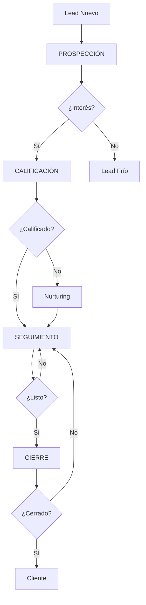

# 📞 GUÍA DE TIPOS DE LLAMADAS - SISTEMA DE LEADS

## 📋 ÍNDICE
1. [Tipos de Llamadas](#tipos-de-llamadas)
2. [Flujo de Conversación](#flujo-de-conversación)
3. [Configuración Técnica](#configuración-técnica)
4. [Casos de Uso](#casos-de-uso)
5. [Mejores Prácticas](#mejores-prácticas)

---

## 📞 TIPOS DE LLAMADAS

### **1. 🔍 PROSPECCIÓN** (`prospecting`)

#### **Propósito**
- Presentar la empresa y servicios
- Descubrir necesidades iniciales del cliente
- Generar interés en las soluciones Jaiopos
- Identificar dolor points y oportunidades

#### **Script de Apertura**
```
"Hola [nombre], soy MarIA de Antares Tech. Veo que [empresa] podría 
beneficiarse de nuestras soluciones Jaiopos para puntos de venta 
conectados con facturación electrónica, yappy y bancos."
```

#### **Preguntas Clave**
- ¿Qué sistema de punto de venta utilizan actualmente?
- ¿Manejan facturación electrónica?
- ¿Tienen problemas con el control de inventario?
- ¿Integran pagos digitales como yappy?
- ¿Qué desafíos enfrentan con su sistema actual?

#### **Objetivos de la Llamada**
- [ ] Presentar Antares Tech y Jaiopos
- [ ] Identificar necesidades específicas
- [ ] Evaluar interés inicial
- [ ] Programar siguiente llamada si hay interés

---

### **2. ✅ CALIFICACIÓN** (`qualification`)

#### **Propósito**
- Evaluar la viabilidad del prospect
- Determinar presupuesto disponible
- Identificar autoridad de decisión
- Establecer timeline del proyecto

#### **Script de Apertura**
```
"Hola [nombre], en nuestra conversación anterior [empresa] mostró 
interés en nuestras soluciones Jaiopos. Quisiera profundizar en 
algunos aspectos para ofrecerte la mejor propuesta."
```

#### **Preguntas Clave**
- ¿Cuál es su volumen mensual de facturación?
- ¿Tienen presupuesto asignado para un nuevo sistema POS?
- ¿Quién toma las decisiones de compra en la empresa?
- ¿Cuándo estarían listos para implementar?
- ¿Qué factores son más importantes en su decisión?

#### **Criterios de Calificación**
- **Necesidad**: ✅ Confirmada / ❌ No clara
- **Presupuesto**: ✅ Disponible / ❌ Sin presupuesto
- **Autoridad**: ✅ Decision maker / ❌ Influencer
- **Timeline**: ✅ < 3 meses / ❌ > 6 meses

---

### **3. 🔄 SEGUIMIENTO** (`follow_up`)

#### **Propósito**
- Retomar conversaciones previas
- Resolver dudas o objeciones
- Mantener el momentum del proceso
- Impulsar hacia la decisión

#### **Script de Apertura**
```
"Hola [nombre], te contacto como seguimiento sobre Jaiopos para 
[empresa]. En nuestra última conversación mencionaste [punto específico], 
¿has tenido oportunidad de evaluarlo?"
```

#### **Preguntas Clave**
- ¿Has podido revisar la información que enviamos?
- ¿Qué dudas han surgido desde nuestra última conversación?
- ¿Hay algún obstáculo que podamos ayudar a resolver?
- ¿Cuáles serían los próximos pasos desde tu perspectiva?
- ¿Necesitas información adicional para tomar la decisión?

#### **Acciones de Seguimiento**
- [ ] Responder preguntas específicas
- [ ] Enviar información adicional
- [ ] Programar demostración
- [ ] Conectar con tomador de decisiones

---

### **4. 🎯 CIERRE** (`closing`)

#### **Propósito**
- Conseguir el compromiso final de compra
- Resolver últimas objeciones
- Definir detalles de implementación
- Formalizar el acuerdo

#### **Script de Apertura**
```
"Hola [nombre], ya tienes toda la información sobre Jaiopos y cómo 
puede beneficiar a [empresa]. ¿Cuál es tu decisión para proceder 
con la implementación?"
```

#### **Preguntas de Cierre**
- ¿Estás listo para proceder con Jaiopos?
- ¿Qué necesitas para tomar la decisión final?
- ¿Cuándo te gustaría comenzar la implementación?
- ¿Hay algún detalle final que debamos resolver?
- ¿Puedo preparar el contrato para la próxima semana?

#### **Técnicas de Cierre**
- **Cierre Asuntivo**: "Procedamos con el plan básico..."
- **Cierre Alternativo**: "¿Prefieres implementar en enero o febrero?"
- **Cierre de Urgencia**: "La promoción termina este mes..."
- **Cierre de Beneficio**: "Con esto ahorrarás X tiempo diario..."

---

### **5. 🔄 RECUPERACIÓN** (`recovery`)

#### **Propósito**
- Reconectar con clientes que mostraron interés pero no estaban decididos
- Retomar el proceso de venta después de un período de pausa
- Abordar dudas o cambios en las circunstancias del cliente
- Reactivar leads que quedaron en pausa por indecisión

#### **Script de Apertura**
```
"Hola [nombre], hace un tiempo hablamos sobre Jaiopos para [empresa]. 
En esa ocasión me mencionaste que estaban evaluando opciones. 
¿Cómo han progresado con esa decisión?"
```

#### **Preguntas Clave**
- ¿Han tenido cambios en sus prioridades de negocio?
- ¿Qué los está deteniendo para tomar una decisión?
- ¿Hay nuevas necesidades que no habíamos considerado antes?
- ¿Sería útil una nueva demostración del sistema?
- ¿Qué información adicional necesitarían para decidir?

#### **Estrategias de Recuperación**
- **Enfoque Consultivo**: "¿Cómo puedo ayudarte a evaluar mejor?"
- **Nuevas Características**: "Hemos agregado funcionalidades que..."
- **Casos de Éxito**: "Clientes similares han obtenido..."
- **Propuesta Flexible**: "Podemos ajustar la propuesta si..."

---

## 🔄 FLUJO DE CONVERSACIÓN

### **Progresión Típica de un Lead**



### **Timeline Recomendado**

| Tipo de Llamada | Intervalo Recomendado | Duración Promedio |
|------------------|----------------------|-------------------|
| **Prospección**  | Primera llamada      | 3-5 minutos      |
| **Calificación** | 2-3 días después     | 5-8 minutos      |
| **Seguimiento**  | 1-2 semanas          | 3-6 minutos      |
| **Cierre**       | Según timeline       | 4-7 minutos      |
| **Recuperación** | 3-6 meses después    | 4-8 minutos      |

---

## ⚙️ CONFIGURACIÓN TÉCNICA

### **Parámetros de la API**

```typescript
interface CallRequest {
  callType: 'prospecting' | 'qualification' | 'follow_up' | 'closing' | 'recovery';
  notes?: string;
}

// Ejemplo de uso
const callData = {
  callType: 'recovery',
  notes: 'Llamada de recuperación - cliente indeciso contactado hace 3 meses'
};
```

### **Variables Dinámicas Disponibles**

| Variable | Descripción | Ejemplo |
|----------|-------------|---------|
| `{{name}}` | Nombre del lead | "Juan Pérez" |
| `{{company}}` | Empresa del lead | "Tienda ABC" |
| `{{lead_source}}` | Origen del lead | "website" |
| `{{lead_status}}` | Estado actual | "interested" |
| `{{call_type}}` | Tipo de llamada | "prospecting" |
| `{{my_company_name}}` | Tu empresa | "Antares Tech" |

### **Configuración en Base de Datos**

```sql
-- Campo callType en LeadCallLog
callType: String @default("prospecting") @map("call_type")

-- Valores permitidos:
- "prospecting"
- "qualification" 
- "follow_up"
- "closing"
- "recovery"
```

---

## 📋 CASOS DE USO

### **Caso 1: Lead de Website**
```
Lead Nuevo (source: website) 
→ PROSPECCIÓN (validar interés)
→ CALIFICACIÓN (evaluar fit)
→ SEGUIMIENTO (nurture)
→ CIERRE (convertir)
```

### **Caso 2: Referido**
```
Lead Referido (source: referral)
→ PROSPECCIÓN (aprovechar referencia)
→ CALIFICACIÓN (fast-track)
→ CIERRE (conversión rápida)
```

### **Caso 3: Lead Frío**
```
Lead Frío (sin respuesta)
→ SEGUIMIENTO (re-engagement)
→ PROSPECCIÓN (nuevo pitch)
→ CALIFICACIÓN (segunda oportunidad)
```

---

## 🎯 MEJORES PRÁCTICAS

### **Para cada Tipo de Llamada**

#### **📝 PROSPECCIÓN**
- ✅ Mantén la llamada corta (3-5 min)
- ✅ Enfócate en descubrir necesidades
- ✅ No vendas, solo explora
- ❌ No presiones por una decisión inmediata

#### **🔍 CALIFICACIÓN**
- ✅ Haz preguntas específicas sobre presupuesto
- ✅ Identifica claramente al decision maker
- ✅ Establece timeline realista
- ❌ No asumas autoridad sin confirmar

#### **📞 SEGUIMIENTO**
- ✅ Referencia conversaciones previas
- ✅ Proporciona valor en cada contacto
- ✅ Mantén consistencia en el mensaje
- ❌ No seas demasiado insistente

#### **🎯 CIERRE**
- ✅ Crea sentido de urgencia apropiado
- ✅ Maneja objeciones con empatía
- ✅ Ofrece opciones claras
- ❌ No presiones si no hay fit

### **Métricas Clave por Tipo**

| Tipo | Métrica Principal | Objetivo |
|------|-------------------|----------|
| **Prospección** | % Interés Generado | > 30% |
| **Calificación** | % Leads Calificados | > 60% |
| **Seguimiento** | % Avance Pipeline | > 40% |
| **Cierre** | % Conversión | > 25% |
| **Recuperación** | % Reactivación | > 15% |

---

## 📊 REPORTES Y ANÁLISIS

### **Dashboards Recomendados**

1. **Por Tipo de Llamada**
   - Volumen de llamadas por tipo
   - Duración promedio por tipo
   - Tasa de éxito por tipo

2. **Por Progression Path**
   - Tiempo entre tipos de llamada
   - Conversión entre etapas
   - Leads perdidos por etapa

3. **Por Performance del Agente**
   - MarIA performance por tipo de llamada
   - Mejores scripts por resultado
   - Optimizaciones necesarias

---

## 🔧 CONFIGURACIÓN DEL SISTEMA

### **Variables de Entorno**
```bash
# Configuración del agente MarIA
ELEVENLABS_AGENT_ID=agent_xxx
ELEVENLABS_API_KEY=sk_xxx
ELEVENLABS_API_URL=https://api.elevenlabs.io

# Configuración de tipos de llamada
DEFAULT_CALL_TYPE=prospecting
CALL_TYPES_ENABLED=prospecting,qualification,follow_up,closing
```

### **Personalización de Scripts**
Los scripts se pueden personalizar en:
- `prompts/maria-complete-prompt.md`
- Variables dinámicas en cada llamada
- Configuración por organización

---

## 🚀 PRÓXIMOS DESARROLLOS

### **Funcionalidades Planificadas**
- [ ] **Auto-progression**: Cambio automático de tipo de llamada según respuesta
- [ ] **A/B Testing**: Diferentes scripts por tipo de llamada
- [ ] **Smart Timing**: IA para determinar mejor momento para cada tipo
- [ ] **Multi-language**: Soporte para llamadas en diferentes idiomas

### **Integraciones**
- [ ] **CRM Integration**: Sync con sistemas CRM externos
- [ ] **Calendar Sync**: Programación automática de seguimientos
- [ ] **Analytics**: Dashboards avanzados por tipo de llamada

---

*📅 Última actualización: 28 de Agosto, 2025*  
*👨‍💻 Documento generado por Claude Code*